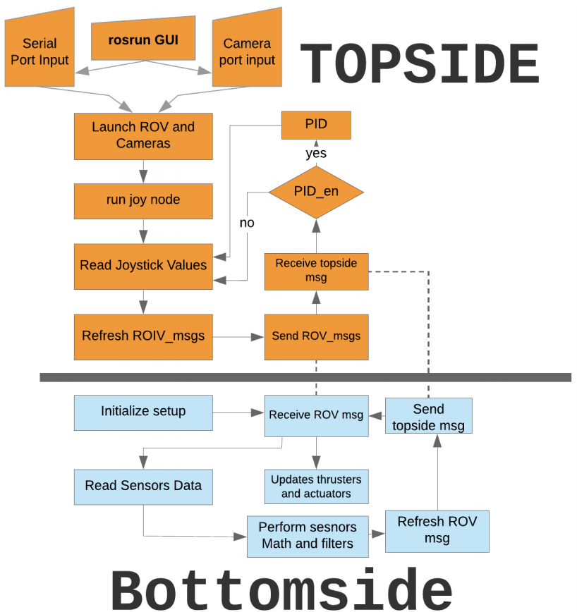
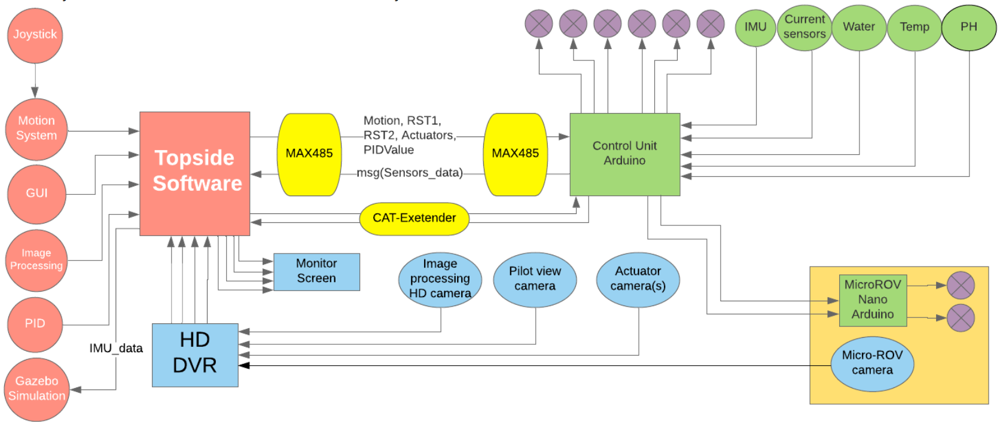

# rov-ros-control
Workspace containing motion, PID, and image processing packages for the control and vision of Remotely Operated Vehicle (ROV).

## System Architecture
The software system is coded entirely in a mixture of C++ and Python codes on Robotics Operating System (ROS). Robotics Operating System grants the software system a layered architecture where each node is independent of the other; which makes the system maintainable and easy to integrate and edit. The API between the nodes is the only thing a coder needs to worry about in designing any node.

The control system is composed of a workspace containing packages that have all of the system running nodes. Several nodes get initialized once the ROV is launched from the GUI; such as Serial Communication, Joystick, PID, GUI, Image processing and helper nodes in between to ease the architecture of the system.

Not only is the system utilizing the power of ROS, but also the power of both languages for their proper use. A C++ library is used for the serial communication since C++ codes have less delay and overhead. Python OpenCV for image processing logic is the most suitable for this use. All in all, ROS enabled us to utilize its incredible integration features to be able to get the best out of each programming language.

## Topside

The topside software is implemented entirely on ROS using python and C++ nodes in an OOP based system. It is composed of several packages: motion_map, serial, GUI, PID, image processing and helper packages. In order to have a distributed system in terms of processing, most of the logic is implemented in the topside software, saving the computing power of the microcontroller in the bottom-side for working as a repeating and a communication channel.

To launch the ROV, the GUI must be launched from the terminal to start the control. From the GUI, anything can be launched conditionally depending on what is being used. The architecture of the topside software is based on making each module serving a purpose independent from other modules as long as the API between packages is agreed upon. This made the development process easier and maintainable.

## Communication

Communication is implemented in C++ to interact with the serial ports of the bottom-side system. There are two communication systems, RS458 modules used as a fullduplex channel connected to TX and RX of Arduino Mega in the ROV. The second system is a backup; using a CATextender in case the modules faced any issue. Both are connected easy to change from the GUI intuitively. The reason why serial is used is because of its reliability; unlike other alternatives like UDP, which is unreliable in terms of losing packets of data. And TCP, which has a communication overhead due to its error checking mechanism, which is something not needed in the current architecture of the system.

## GUI

Our GUI is quite intuitive for launching and terminating every possible feature in the ROV. It is also used to monitor the feedback system that is composed of a cluster of sensors to make sure every electronic and mechanical process going on in the ROV monitored by the pilot and each error is detected for correction. The GUI has tabs to ease the navigation of the pilot through it. There is a feedback tab to monitor the feedback system. There is also the cameras’ feedback tab where the pilot uses as a main navigation view. There are also two tabs related to mission-related tasks; line follower and distance measurement applied on the canon for the copilot to use during the mission. Navigating between tabs is quite userfriendly and does not overwhelm the pilot with everything in one place.

## PID

Applying control theory, the ROV has a self-correcting mechanism of stabilization. Our stabilization system is based on PID applied on feedback from Inertial Measurement Unit as part of the sensors feedback subsystem. The PID logic and output is in a collection of PID nodes that are all part of the PID package, which of course, publishes its feedback to the motors if the pilot enabled it.

## Image processing

OpenCV library was extensively used for our real-time computer vision and image processing tasks. Color detection was used for identification of the red transect line to follow and of the blue crack. Five regions of interest were set on the screen to know where the red line is detected and when it has corners so as to follow it. Crack length was measured based on pixel ratio measurement where the known reference length was the red line width. Same idea was used for calculating the cannon’s length and its three radii, with the ability to freely choose the known reference length. Species detection was based on contour approximation, an algorithm implemented in openCV: a curve can be approximated by a series of short line segments; the resulting approximated curve will consist of a subset of points that were defined by the original curve. The number of vertices of the contour can hence determine the shape of an object: 2 for lines, 3 for triangles, 4 for squares, and more for circles. More detailed diagram can be found in the Appendix section under image processing.

## Bottom-side

The bottom side is composed of the micro-controller Arduino-Mega and the sensors subsystems on it. This layer in the system has the features of being devoid of needing rigorous computing power since most of the logic and software complexity is distributed in the topside nodes. Arduino Mega provides us with several hardware serial channels; two of them are used as main and back-up channels in the system. It merely works as repeater by receiving commands from the topside and always sending feedback to the topside.

Sensors that are used are: Current sensors distributed on the thrusters tracks in the PCB, IMU, Water sensor, Temperature, Metal Sensor and PH. All collectively form a representative feedback system.
